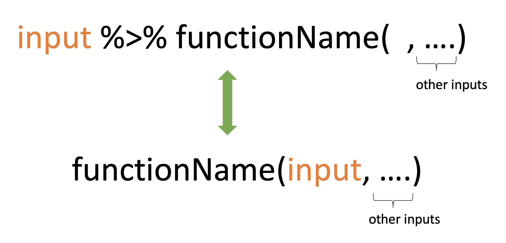

# Introduction to Tidyverse

## What is the tidyverse?

-   Collection of essential R packages for data science.

-   All packages share a common design philosophy, grammar, and data structures.

## Setup

``` r
install.packages("tidyverse") # install tidyverse packages
library(tidyverse) # load tidyverse packages
```

```{r}
#| echo: false
library(tidyverse)
```

## Tibble

-   Tibble is a modern version of dataframes.

-   A modern re-imagining of data frames.

### Create a tibble

```{r, comment=NA, message=FALSE}
library(tidyverse) # library(tibble)
first.tbl <- tibble(height = c(150, 200, 160), weight = c(45, 60, 51))
first.tbl
```

```{r, comment=NA, message=FALSE}
class(first.tbl)
```

### Convert an existing dataframe to a tibble

```{r, comment=NA}
as_tibble(iris)

```

### Convert a tibble to a dataframe

```{r, comment=NA}
first.tbl <- tibble(height = c(150, 200, 160), weight = c(45, 60, 51))
class(first.tbl)
first.tbl.df <- as.data.frame(first.tbl)
class(first.tbl.df)
```

### tibble vs data.frame

1.  The way they print output

**tibble**

```{r, comment=NA}
first.tbl <- tibble(height = c(150, 200, 160), weight = c(45, 60, 51))
first.tbl
```

**data.frame**

```{r, comment=NA}
dataframe <- data.frame(height = c(150, 200, 160), weight = c(45, 60, 51))
dataframe
```

2.  With tibble you can create new variables that are functions of existing variables.

**tibble**

```{r, comment=NA}
first.tbl <- tibble(height = c(150, 200, 160), weight = c(45, 60, 51), 
                    bmi = (weight)/height^2)
first.tbl
```

**data.frame**

```{r, comment=NA, eval=FALSE}
df <- data.frame(height = c(150, 200, 160), weight = c(45, 60, 51), 
                    bmi = (weight)/height^2) # Not working
```

You will get an error message

[`Error in data.frame(height = c(150, 200, 160), weight = c(45, 60, 51),  :    object 'height' not found.`]{style="color:red"}

With `data.frame` this is how we should create a new variable from the existing columns.

```{r, comment=NA}
df <- data.frame(height = c(150, 200, 160), weight = c(45, 60, 51)) 
df$bmi <- (df$weight)/(df$height^2)
df
```

3.  In contrast to data frames, the variable names in tibbles can contain spaces.

**Example 1**

```{r, comment=NA}
tbl <- tibble(`patient id` = c(1, 2, 3))
tbl
```

```{r, comment=NA}
df <- data.frame(`patient id` = c(1, 2, 3))
df
```

4.  In contrast to data frames, the variable names in tibbles can start with a number.


```{r, comment=NA}
tbl <- tibble(`1var` = c(1, 2, 3))
tbl
```

```{r, comment=NA}
df <- data.frame(`1var` = c(1, 2, 3))
df
```

In general, tibbles do not change the names of input variables and do not use row names.

5.  A tibble can have columns that are lists.

**tibble**

```{r, comment=NA}
tbl <- tibble (x = 1:3, y = list(1:3, 1:4, 1:10))
tbl
```

**data.frame**

This feature is not available in `data.frame`.

If we try to do this with a traditional data frame we get an error.

```{r, comment=NA, eval=FALSE}
df <- data.frame(x = 1:3, y = list(1:3, 1:4, 1:10)) ## Not working, error

```

`Error in (function (..., row.names = NULL, check.rows = FALSE, check.names = TRUE,  : arguments imply differing number of rows: 3, 4, 10`

### Subsetting: tibble vs data.frame

#### Subsetting single columns

**data.frame**

```{r, comment=NA, message=FALSE}
df <- data.frame(x = 1:3, 
                 yz = c(10, 20, 30)); df
df[, "x"]
df[, "x", drop=FALSE]
```

**tibble**

```{r,  comment=NA, message=FALSE}
tbl <- tibble(x = 1:3, 
              yz = c(10, 20, 30)); tbl
tbl[, "x"]
```

```{r,  comment=NA, message=FALSE}
tbl <- tibble(x = 1:3, 
              yz = c(10, 20, 30))
tbl
tbl[, "x"]

```

```{r,  comment=NA, message=FALSE}
# Method 1
tbl[, "x", drop = TRUE]

# Method 2
as.data.frame(tbl)[, "x"]

```

#### Subsetting single rows with the drop argument

**data.frame**

```{r comment=NA, message=FALSE}
df[1, , drop = TRUE]
```

**tibble**

```{r comment=NA, message=FALSE}
tbl[1, , drop = TRUE]
as.list(tbl[1, ])
```

#### Accessing non-existent columns

**data.frame**

```{r comment=NA, message=FALSE}
df$y

df[["y", exact = FALSE]]

df[["y", exact = TRUE]]
```

**tibble**

```{r comment=NA, message=FALSE}
tbl$y


tbl[["y", exact = FALSE]]

tbl[["y", exact = TRUE]]

```

### Some functions that work with both tibbles and dataframes

``` r
names(), colnames(), rownames(), ncol(), nrow(), length() # length of the underlying list
```

**tibble**

```{r, comment=NA}
tb <- tibble(a = 1:3)
names(tb)
colnames(tb)
rownames(tb)
nrow(tb); ncol(tb); length(tb)
```

**data.frame**

```{r, comment=NA}
df <- data.frame(a = 1:3)
names(df)
colnames(df)
rownames(df)
nrow(df); ncol(df); length(df)
```

However, when using tibble, we can use some additional commands

```{r, comment=NA}
is_tibble(tb) 
glimpse(tb)
```

## Factors

**factor**

-   A vector that is used to store categorical variables.

-   It can only contain predefined values. Hence, factors are useful when you know the possible values a variable may take.

**Creating a factor vector**

```{r, comment=NA}
grades <- factor(c("A", "A", "A", "C", "B"))
grades
```

Now let's check the class type

```{r, comment=NA}
class(grades) # It's a factor
```

To obtain all levels

```{r, comment=NA}
levels(grades)
```

### Creating a factor vector

-   With factors all possible values of the variables can be defined under levels.

```{r, comment=NA}
grade_factor_vctr <- 
  factor(c("A", "D", "A", "C", "B"), 
         levels = c("A", "B", "C", "D", "E"))
grade_factor_vctr
levels(grade_factor_vctr)
class(levels(grade_factor_vctr))
```

### Character vector vs Factor

-   Observe the differences in outputs. Factor prints all possible levels of the variable.

**Character vector**

```{r, comment=NA}
grade_character_vctr <- c("A", "D", "A", "C", "B")
grade_character_vctr
```

**Factor vector**

```{r, comment=NA}
grade_factor_vctr <- factor(c("A", "D", "A", "C", "B"), 
         levels = c("A", "B", "C", "D", "E"))
grade_factor_vctr
```

-   Factors behave like character vectors but they are actually integers.

**Character vector**

```{r, comment=NA}
typeof(grade_character_vctr)
```

**Factor vector**

```{r, comment=NA}
typeof(grade_factor_vctr)
```

-   Let's create a contingency table with `table` function.

**Character vector output with table function**

```{r, comment=NA}
grade_character_vctr <- c("A", "D", "A", "C", "B")
table(grade_character_vctr)
```

**Factor vector (with levels) output with table function**

```{r, comment=NA}
grade_factor_vctr <- 
  factor(c("A", "D", "A", "C", "B"), 
         levels = c("A", "B", "C", "D", "E"))
table(grade_factor_vctr)
```

-   Output corresponds to factor prints counts for all possible levels of the variable. Hence, with factors it is obvious when some levels contain no observations.

-   With factors you can't use values that are not listed in the levels, but with character vectors there is no such restrictions.

**Character vector**

```{r, comment=NA}
grade_character_vctr[2] <- "A+"
grade_character_vctr
```

**Factor vector**

```{r, comment=NA}
grade_factor_vctr[2] <- "A+"
grade_factor_vctr
```

### Modify factor levels

This our factor

```{r, comment=NA}
grade_factor_vctr
```

### Change labels

```{r, comment=NA}
levels(grade_factor_vctr) <- 
  c("Excellent", "Good", "Average", "Poor", "Fail")
grade_factor_vctr
```

### Reverse the level arrangement

```{r, comment=NA}
levels(grade_factor_vctr) <- rev(levels(grade_factor_vctr))
grade_factor_vctr
```

### Order of factor levels

**Default order of levels**

```{r, fih.height=3, comment=NA}
fv1 <- factor(c("D","E","E","A", "B", "C"))
fv1

```

```{r, fih.height=3, comment=NA}
fv2 <- factor(c("1T","2T","3A","4A", "5A", "6B", "3A"))
fv2

```

```{r}
df <- data.frame(fv2=fv2)
library(ggplot2)
ggplot(df, aes(x=fv2)) + geom_bar()
```

You can change the order of levels

```{r, comment=NA, fig.height=2}
fv2 <- factor(c("1T","2T","3A","4A", "5A", "6B", "3A"), 
              levels = c("3A", "4A", "5A", "6B", "1T", "2T"))
fv2
```

```{r}
df <- data.frame(fv2=fv2)
library(ggplot2)
ggplot(df, aes(x=fv2)) + geom_bar()
```

Note that tibbles do not change the types of input variables (e.g., strings are not converted to factors by default).

```{r, comment=NA}
tbl <- tibble(x1 = c("setosa", "versicolor", "virginica", "setosa"))
tbl
```

```{r, comment=NA}
df <- data.frame(x1 = c("setosa", "versicolor", "virginica", "setosa"))
df
class(df$x1)
```

## Pipe operator: %\>% or \|\>

### Required package: `magrittr` (for %\>%)

```{r, eval=FALSE}
install.packages("magrittr")
library(magrittr)
```

```{r, echo=FALSE}
library(magrittr)
```

### What does it do?

It takes whatever is on the left-hand-side of the pipe and makes it the first argument of whatever function is on the right-hand-side of the pipe.

For instance,

```{r, comment=NA}
mean(1:10)
```

can be written as

```{r, comment=NA}
1:10 %>% mean()
```



### Illustrations

1.  `x %>% f(y)` turns into `f(x, y)`

2.  `x %>% f(y) %>% g(z)` turns into `g(f(x, y), z)`

### Why %\>%

-   This helps to make your code more readable.

**Method 1: Without using pipe (hard to read)**

```{r, comment=NA}
colSums(matrix(c(1, 2, 3, 4, 8, 9, 10, 12), nrow=2))

```

**Method 2: Using pipe (easy to read)**

```{r, comment=NA}
c(1, 2, 3, 4, 8, 9, 10, 12) %>%
  matrix( , nrow = 2) %>%
  colSums()
```

or

```{r, comment=NA}
c(1, 2, 3, 4, 8, 9, 10, 12) %>%
  matrix(nrow = 2) %>% # remove comma
  colSums()
```

### Rules

```{r, comment=NA}
library(tidyverse) # to use as_tibble
library(magrittr) # to use %>%
df <- data.frame(x1 = 1:3, x2 = 4:6)
df
```

**Rule 1**

``` r
head(df) 
df %>% head()
```

```{r, echo=FALSE, comment=NA}
library(tidyverse)
library(magrittr)
df %>% head()
```

**Rule 2**

``` r
head(df, n = 2)  
df %>% head(n = 2)
```

```{r, echo=FALSE, comment=NA}
df %>% head(n = 2)
```


**Rule 3**

``` r
head(df, n = 2)
2 %>% head(df, n = .)
```

```{r, echo=FALSE, comment=NA}
2 %>% head(df, n = .)
```

**Rule 4**

``` r
head(as_tibble(df), n = 2)
df %>% as_tibble() %>%
head(n = 2)
```

```{r, echo=FALSE, comment=NA}
df %>% as_tibble() %>% head(n = 2)
```

**Rule 5: subsetting**

``` r
df$x1
df %>% .$x1
```

```{r, echo=FALSE, comment=NA}
df %>% .$x1
```

or

``` r
df[["x1"]]
df %>% .[["x1"]]
```

```{r, echo=FALSE, comment=NA}
df %>% .[["x1"]]
```

or

``` r
df[[1]]
df %>% .[[1]]
```

```{r, echo=FALSE, comment=NA}
df %>% .[[1]]
```

### Offline reading materials

Type the following codes to see more examples:

```{r, eval=FALSE}
vignette("magrittr")
vignette("tibble")
```
