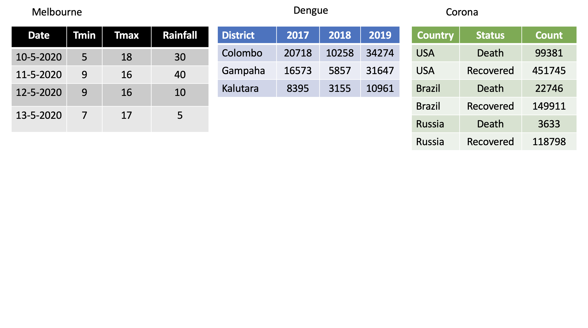
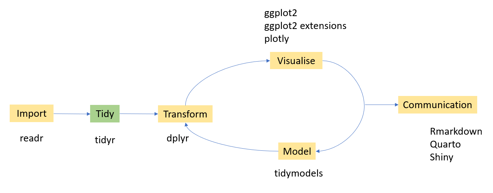
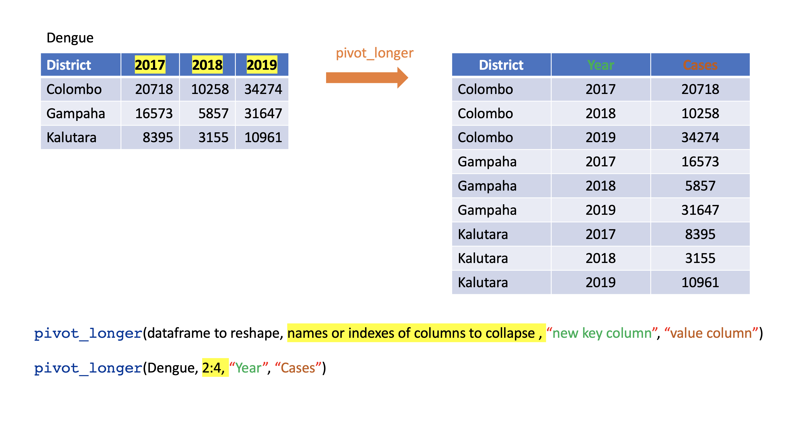
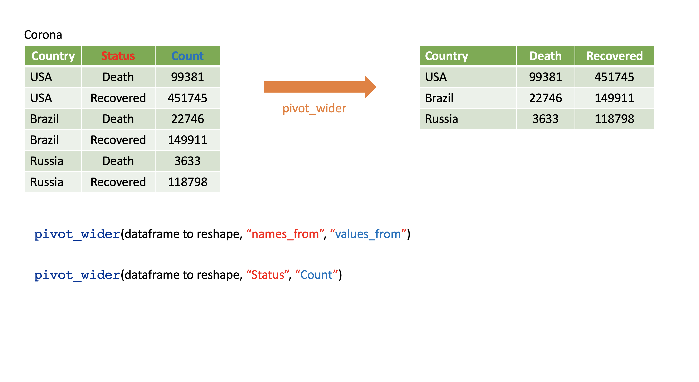
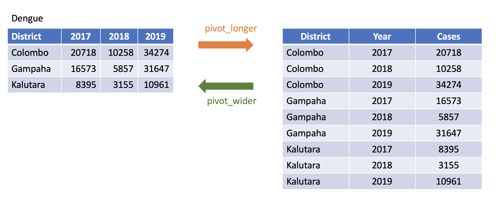
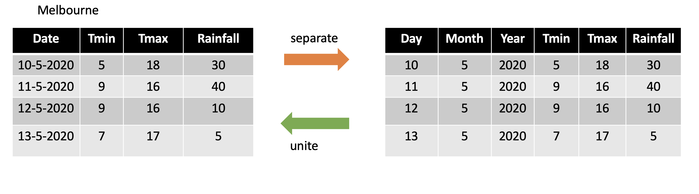
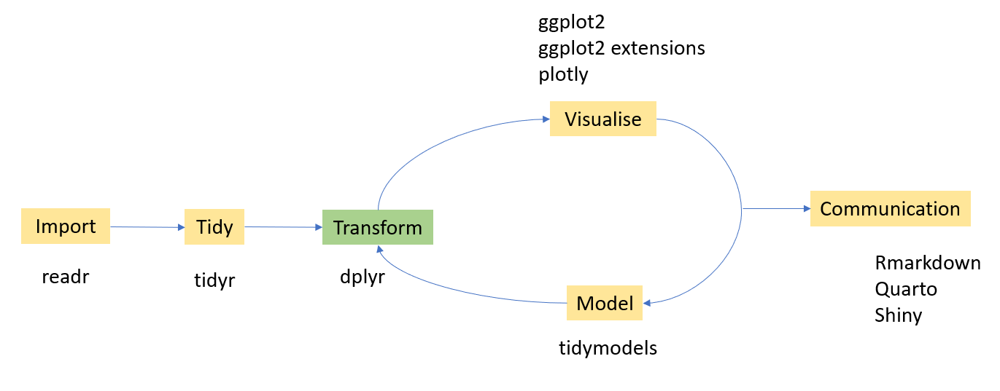

# Data Wrangling

## Tidy Data

-   Each **variable** is placed in its column

-   Each **observation** is placed in its own row

-   Each **value** is placed in its own cell

### Which data frames are tidy?



## Reshaping data with tidyr




How to reshape your data in order to make the analysis easier?

We are going to learn four main functions in the `tidyr` package.

-   pivot_wider

-   pivot_longer

-   seperate

-   unite

**Input and Output type for `tidyr` functions**

Main input: `data frame` or `tibble`.

Output: `tibble`

### `pivot_longer()`

-   Turns columns into rows.

-   From wide format to long format.

```{r, comment=NA, echo=FALSE, out.width="72%"}

```

```{r, comment=NA, warning=FALSE, message=FALSE}
library(tidyverse)
dengue <- tibble( dist = c("Colombo", "Gampaha", "Kalutara"), 
                  '2017' = c(20718, 10258, 34274), 
                  '2018' = c(16573, 5857, 31647), 
                  '2019' = c(8395, 3155, 10961)); 
dengue
```

```{r, comment=NA, warning=FALSE, message=FALSE}
dengue %>% 
  pivot_longer(2:4,
               names_to="Year", 
               values_to = "Dengue counts")
```

### `pivot_wider()`

-   From long to wide format.



```{r, comment=NA}
Corona <- tibble(
country = rep(c("USA", "Brazil", "Russia"), each=2),
status = rep(c("Death", "Recovered"), 3),
count = c(99381, 451745, 22746, 149911, 3633, 118798))
```

```{r, comment=NA}
Corona 
```

```{r, comment=NA, message=FALSE, warning=FALSE}
Corona %>% 
  pivot_wider(names_from=status, 
              values_from=count)

```

#### Assign a name to the new dataset

```{r, comment=NA, message=FALSE, warning=FALSE}
corona_wide_format <- Corona %>% 
  pivot_wider(names_from=status, 
              values_from=count)
corona_wide_format 

```

#### `pivot_longer` vs `pivot_wider`



#### Dealing with missing values

```{r, comment=NA, echo=FALSE, comment=NA}
profit <- tibble(
year = c(2015, 2015, 2015, 2015, 2016, 2016, 2016),
quarter = c( 1, 2, 3, 4, 2, 3, 4),
income = c(2, NA, 3, NA, 4, 5, 6)
)
profit
```

```{r, comment=NA, message=FALSE, warning=FALSE}
profit %>%
pivot_wider(names_from = year, values_from = income)
```

Remove missing values

```{r,  comment=NA, message=FALSE}
profit %>%
pivot_wider(names_from = year, values_from = income) %>%
pivot_longer(
cols = c(`2015`, `2016`),
names_to = "year",
values_to = "income",
values_drop_na = TRUE
)
```

### `separate()`

-   Separate one column into several columns.

```{r, comment=NA, message=FALSE}
Melbourne <- 
  tibble(Date = c("10-5-2020", "11-5-2020", "12-5-2020","13-5-2020"),
         Tmin = c(5, 9, 9, 7), Tmax = c(18, 16, 16, 17),
         Rainfall= c(30, 40, 10, 5)); Melbourne
```

```{r, comment=NA, message=FALSE}
Melbourne %>% separate(Date, into=c("day", "month", "year"), sep="-")
```

```{r, comment=NA, message=FALSE, warning=FALSE}
df <- data.frame(x = c(NA, "a.b", "a.d", "b.c"))
df
df %>% separate(x, c("Text1", "Text2"))
```

```{r, comment=NA}
tbl <- tibble(input = c("a", "a b", "a-b c", NA))
tbl
```

```{r, comment=NA}
tbl %>% 
  separate(input, c("Input1", "Input2"))
```

```{r, comment=NA}
tbl <- tibble(input = c("a", "a b", "a-b c", NA)); tbl
```

```{r, comment=NA}
tbl %>% separate(input, c("Input1", "Input2", "Input3"))
```

### `unite()`

-   Unite several columns into one.

```{r, comment=NA, warning=FALSE, message=FALSE}
projects <- tibble(
  Country = c("USA", "USA", "AUS", "AUS"),
  State = c("LA", "CO", "VIC", "NSW"),
  Cost = c(1000, 11000, 20000,30000)
)
projects
```

```{r, echo=FALSE, comment=NA}
projects
```

```{r, comment=NA, warning=FALSE, message=FALSE}

projects %>% unite("Location", c("State", "Country"))
```

Specify the separator that you want to separate

```{r, comment=NA, warning=FALSE, message=FALSE}
projects %>% unite("Location", c("State", "Country"),
                   sep="-")
```

#### `separate` vs `unite`



## Data minipulation with `dplyr`




Under data manipulation with `dplyr` we will learn six main functions in the dplyr package. They are

-   `filter`

-   `select`

-   `mutate`

-   `summarise`

-   `arrange`

-   `group_by`

-   `rename`

### Dataset used for demonstrations

```{r, comment=NA, message=FALSE}
library(gapminder)
str(gapminder)
head(gapminder)
```

```{r, comment=NA, message=FALSE}
glimpse(gapminder)
```

```{r, comment=NA, message=FALSE}
tbl_df(gapminder)
```

```{r, comment=NA, out.height="50%", eval=FALSE}
library(skimr)
skim(gapminder)
```

### `filter`

-   Picks observations by their values.

-   Takes logical expressions and returns the rows for which all are `TRUE`.

```{r, comment=NA, message=FALSE}
filter(gapminder, lifeExp < 50)
```

```{r, comment=NA, message=FALSE}
# gapminder %>% filter(country == "Sri Lanka")
filter(gapminder, country == "Sri Lanka")
```

```{r, comment=NA, message=FALSE}
filter(gapminder, country %in% c("Sri Lanka", "Australia"))
```

```{r, comment=NA, message=FALSE}
filter(gapminder, country %in% c("Sri Lanka", "Australia")) %>%
 head()
```

```{r, comment=NA, message=FALSE}
filter(gapminder, country %in% c("Sri Lanka", "Australia")) %>%
 tail()
```

### `select`

-   Picks variables by their names.

```{r, comment=NA, message=FALSE}
head(gapminder, 3)
```

```{r, comment=NA, message=FALSE, warning=FALSE}
select(gapminder, year:gdpPercap)
```

```{r, comment=NA, message=FALSE, warning=FALSE}
select(gapminder, year, gdpPercap)
```

```{r, comment=NA, message=FALSE, warning=FALSE}
select(gapminder, -c(year, gdpPercap))
```

```{r, comment=NA, message=FALSE, warning=FALSE}
select(gapminder, -(year:gdpPercap))
```

### `mutate`

-   Creates new variables with functions of existing variables

```{r, comment=NA, message=FALSE, warning=FALSE}
gapminder %>% mutate(gdp = pop * gdpPercap)
```

### `summarise`(British) or `summarize` (US)

-   Collapse many values down to a single summary

```{r, comment=NA, message=FALSE, warning=FALSE}
gapminder %>%
  summarise(
    lifeExp_mean=mean(lifeExp),
    pop_mean=mean(pop),
    gdpPercap_mean=mean(gdpPercap))
```

### `arrange`

-   Reorder the rows

```{r, comment=NA, message=FALSE, warning=FALSE}
arrange(gapminder, desc(lifeExp))
```

### `group_by`

-   Takes an existing tibble and converts it into a grouped tibble where operations are performed "by group". ungroup() removes grouping.

```{r, comment=NA, message=FALSE, warning=FALSE}
Japan_SL <- filter(gapminder, country %in% c("Japan", "Sri Lanka"))
Japan_SL %>% head()
```

```{r, comment=NA, message=FALSE, warning=FALSE}
Japan_SL_grouped <- Japan_SL %>% group_by(country)
Japan_SL_grouped
```

```{r, comment=NA, message=FALSE, warning=FALSE}
Japan_SL %>% summarise(mean_lifeExp=mean(lifeExp))
```

```{r, comment=NA, message=FALSE, warning=FALSE}
Japan_SL_grouped %>% summarise(mean_lifeExp=mean(lifeExp))
```

### `rename`

-   Rename variables

```{r, comment=NA, message=FALSE}
head(gapminder, 3)
```

```{r, comment=NA, message=FALSE, warning=FALSE}
rename(gapminder, `life expectancy`=lifeExp,
       population=pop) # new_name = old_name
```

### Combine multiple operations

Example 1

```{r, comment=NA, message=FALSE}
gapminder %>%
filter(country == 'China') %>% head(2)
```

Example 2

```{r, comment=NA, message=FALSE}
gapminder %>%
filter(country == 'China') %>% summarise(lifemax=max(lifeExp))
```

Example 3

```{r, comment=NA, message=FALSE}
gapminder %>%
filter(country == 'China') %>%
filter(lifeExp == max(lifeExp))
```

Example 4

```{r, comment=NA}
gapminder %>%
filter(continent == 'Asia') %>%
group_by(country) %>%
filter(lifeExp == max(lifeExp)) %>%
arrange(desc(year))
```

## Combine Data Sets

In this section we will learn different ways of koining the datasets.

**Mutating joins**

-   `left_join`

-   `right_join`

-   `inner_join`

-   `full_join`

**Set operations**

-   `intersect`

-   `union`

**Binding**

-   `bind_rows`

-   `bind_cols`

## Mutating joins

### `left_join`

```{r, comment=NA, message=FALSE, warning=FALSE}
first <- tibble(x1=c("A", "B", "C"), x2=c(1, 2, 3))
second <- tibble(x1=c("A", "B", "D"), x3=c("red", "yellow" , "green"))
```

```{r, comment=NA, message=FALSE}
first


```

```{r, comment=NA, message=FALSE}
second

```

```{r, comment=NA, message=FALSE}
left_join(first, second, by="x1")
```

### `right_join`

```{r, comment=NA, message=FALSE, warning=FALSE}
first <- tibble(x1=c("A", "B", "C"), x2=c(1, 2, 3))
second <- tibble(x1=c("A", "B", "D"), x3=c("red", "yellow" , "green"))
```

```{r, comment=NA, message=FALSE}
first

```

```{r, comment=NA, message=FALSE}
second

```

```{r, comment=NA, message=FALSE}
right_join(first, second, by="x1")
```

### `inner_join`

```{r, comment=NA, message=FALSE, warning=FALSE}
first <- tibble(x1=c("A", "B", "C"), x2=c(1, 2, 3))
second <- tibble(x1=c("A", "B", "D"), x3=c("red", "yellow" , "green"))
```

```{r, comment=NA, message=FALSE}
first
```

```{r, comment=NA, message=FALSE}
second

```

```{r, comment=NA, message=FALSE}
inner_join(first, second, by="x1")
```

### `full_join`

```{r, comment=NA, message=FALSE, warning=FALSE}
first <- tibble(x1=c("A", "B", "C"), x2=c(1, 2, 3))
second <- tibble(x1=c("A", "B", "D"), x3=c("red", "yellow" , "green"))
```

```{r, comment=NA, message=FALSE}
first
```

```{r, comment=NA, message=FALSE}
second
```

```{r, comment=NA, message=FALSE}
full_join(first, second, by="x1")
```

## Set operations

Two compatible data sets. Column names are the same.

```{r, comment=NA, message=FALSE, warning=FALSE}
first <- tibble(x1=c("A", "B", "C"), x2=c(1, 2, 3))
second <- tibble(x1=c("D", "B", "C"), x2=c(10, 2, 3))
```

```{r, comment=NA, message=FALSE}
first
```

```{r, comment=NA, message=FALSE}
second
```

### intersect

```{r, comment=NA, message=FALSE}
intersect(first, second)
```

### union

```{r, comment=NA, message=FALSE}
union(first, second)
```

### intersect: Two compatible data sets. Column names are the same but the values are different

```{r, comment=NA, message=FALSE, warning=FALSE}
first <- tibble(x1=c("A", "B", "C"), x2=c(1, 2, 3))
second <- tibble(x1=c("D", "B", "C"), x2=c(10, 20, 30))
```

```{r, comment=NA, message=FALSE}
first
```

```{r, comment=NA, message=FALSE}
second
```

```{r, comment=NA, message=FALSE}
intersect(first, second)
```

### union: Two compatible data sets. Column names are the same but the values are different

```{r, comment=NA, message=FALSE}
union(first, second)
```

## Binding operations

```{r, comment=NA, message=FALSE, warning=FALSE}
first <- tibble(x1=c("A", "B", "C"), x2=c(1, 2, 3))
second <- tibble(x1=c("D", "B", "C"), x2=c(10, 20, 30))
```

```{r, comment=NA, message=FALSE}
first
```

```{r, comment=NA, message=FALSE}
second
```

### bind_rows

```{r, comment=NA, message=FALSE}
bind_rows(first, second)
```

### bind_cols

```{r, comment=NA, message=FALSE}
bind_cols(first, second)
```

## Exercise

This exercise is based on the `DStidy` dataset from the `DSjobtracker` package in R. This dataset was compiled from job advertisements for roles like statisticians and data scientists. It includes information on job roles, required qualifications, technical and soft skills, tools, platforms, and other relevant criteria frequently mentioned in the job advertisements. Write R code to answer each question. Use the provided output to verify the correctness of your code.

1.  How many job advertisements mention both `R` and `Python` as required skills?

```{r}
#| echo: false
#| warning: false
#| message: false
library(tidyverse)
library(DSjobtracker)
data(DStidy)
DStidy |>
  filter(R == 1, Python == 1) |>
  nrow()
```

2.  Which job categories require R but not Python?

Help: `distinct` function

```{r}
#| echo: false
#| warning: false
#| message: false
DStidy %>%
  filter(R == 1, Python == 1) %>%
  distinct(Job_Category)

```

3.  What is the most common educational qualification required (BSc_needed, MSc_needed, PhD_needed) across all job categories?

```{r}
#| echo: false
#| warning: false
#| message: false
DStidy %>%
  summarise(
    BSc = sum(BSc_needed == 1, na.rm = TRUE),
    MSc = sum(MSc_needed == 1, na.rm = TRUE),
    PhD = sum(PhD_needed == 1, na.rm = TRUE)
  )
```

4.  What is the average salary for job roles that require SQL, grouped by Job_Category?

```{r}
#| echo: false
#| warning: false
#| message: false
DStidy %>%
  filter(SQL == 1) %>%
  group_by(Job_Category) %>%
  summarise(avg_salary = mean(Salary, na.rm = TRUE)) %>%
  arrange(desc(avg_salary))

```

5.  Calculate the proportion of job advertisements that require English by City.

```{r}
#| echo: false
#| warning: false
#| message: false
DStidy %>%
  group_by(City) %>%
  summarise(Prop_English = mean(`English Needed` == 1, na.rm = TRUE)) %>%
  arrange(desc(Prop_English))
```

6.  Select only the columns: ID, Job_title, Company, and City.

```{r}
#| echo: false
#| warning: false
#| message: false
DStidy %>% select(ID, Job_title, Company, City)

```

7.  Filter the dataset to include only jobs that mention Python as a required skill.

```{r}
#| echo: false
#| warning: false
#| message: false
DStidy %>% filter(Python == 1)

```

8.  Select all columns related to Microsoft Office tools.

```{r}
#| echo: false
#| warning: false
#| message: false
DStidy %>% select(matches("MS Word|MS Excel|MS PowerPoint|Ms Access"))

```

9.  Filter jobs that were published in or after the year 2023.

Help: use `year` function in the lubridate package

```{r}
#| echo: false
#| warning: false
#| message: false
DStidy %>% filter(lubridate::year(DatePublished) >= 2023)

```

10. Filter the jobs where both PhD_needed and MSc_needed are 0.

```{r}
#| echo: false
#| warning: false
#| message: false
DStidy %>% filter(PhD_needed == 0, MSc_needed == 0)
```

11. Filter out all rows where Salary is missing (NA).

```{r}
#| echo: false
#| warning: false
#| message: false
DStidy %>% filter(!is.na(Salary))

```

12. For each Experience_Category, compute the percentage of jobs that require Presentation_Skills.

```{r}
#| echo: false
#| warning: false
#| message: false
DStidy %>%
  group_by(Experience_Category) %>%
  summarise(prop_presentation = mean(Presentation_Skills == 1, na.rm = TRUE))
```
